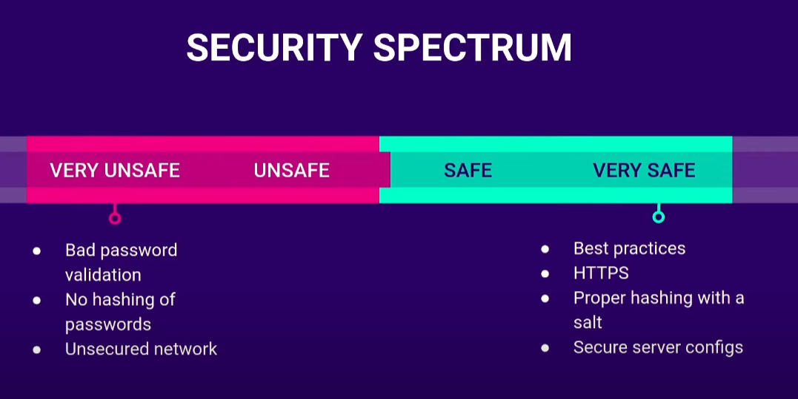
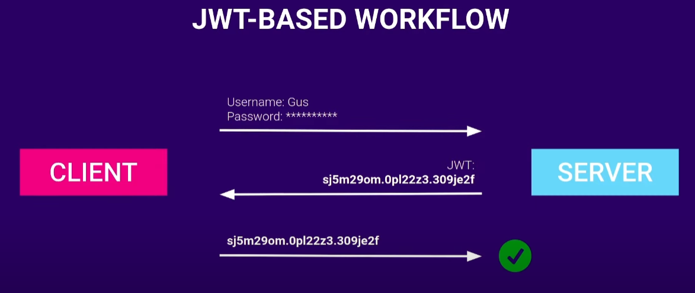

# WEB AUTHENTICATION

---

## Type of authentication
Single Sign-On (SSO)
Multi-Factor Authentication (MFA)
Passwordless
WebAuthn

---

## Password-based

---

## COOKIES & JWT

Works with sessions. State lives on the server

---

Works with signed tokens. State is on the client

---

## References
[1] Web Authentication Methods Explained. https://youtu.be/LB_lBMWH4-s?si=uwXj5S6QUwpQYdXq
[2] HTTP Cookie. https://en.wikipedia.org/wiki/HTTP_cookie
[3] Introduction to JSON Web Tokens. https://jwt.io/introduction